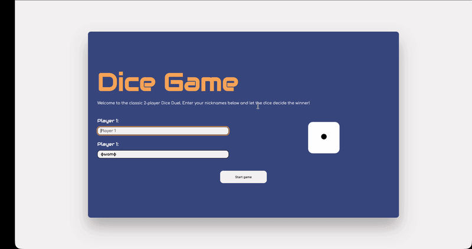

# 🎲 Dice Duel (Advanced Pig Game)

A classic 2-player dice game built with Vanilla JavaScript. This project is based on the popular "Pig Game" concept, but heavily extended with a custom Start Menu, pure CSS-animated dice, and full keyboard accessibility.

## ✨ Key Features & Improvements

While the core game logic is a classic JS exercise, I took it a step further to practice UI/UX and advanced DOM manipulation:

- **Custom Start Menu:** Players can enter their custom nicknames before the game starts (handling form submissions and DOM updates).
- **Pure CSS Dice:** No images used! The dice and its dots are fully rendered using CSS Flexbox and dynamically controlled via JavaScript classes.
- **Keyboard Accessibility:** The game can be fully played without a mouse:
  - `Enter` - Roll the dice
  - `Space` - Hold current score
  - `R` - Restart the game
  - `Escape` - Quit to main menu
- **State Management:** Strict separation between the UI (DOM) and the application state (variables).
- **Defensive Programming:** Implemented blocks to prevent hotkeys from firing while the user is typing in the input fields.

## 🎮 How to Play

1. Enter nicknames for Player 1 and Player 2.
2. The active player rolls the dice to accumulate a "Current Score".
3. If the player rolls a **1**, their current score is lost, and the turn passes to the opponent.
4. The player can choose to **Hold**, which adds their "Current Score" to their "Total Score".
5. The first player to reach **100 points** wins the game!

## 🛠 Tech Stack

- **HTML5** (Semantic structure)
- **CSS3** (Flexbox, Keyframe Animations, BEM methodology elements, Backdrop-filter)
- **Vanilla JavaScript** (ES6+, Event Delegation, DOM API, Short-circuiting)

## 🧠 What I Learned

Through building this project, I solidified my understanding of:

- **The DOM Tree vs. DOM API:** How elements inherit methods from `EventTarget` and `Node`.
- **Keyboard Events:** Handling `keydown` events and preventing default browser behaviors.
- **Refactoring:** Moving away from reading state directly from the DOM to keeping a "Single Source of Truth" in JS variables.
